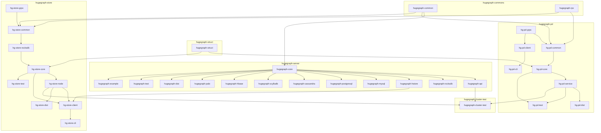
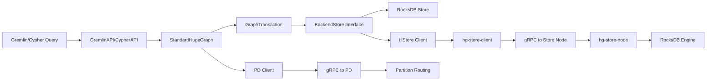

# Code Graph — HugeGraph Module & Interface Map

This document provides a structured code graph of the HugeGraph repository.
Relations are tagged with confidence labels (inspired by Graphify):

| Label | Meaning |
|-------|--------|
| EXTRACTED | Explicitly declared in code (pom.xml dependency, import, interface impl) |
| INFERRED | Deduced from usage patterns or documentation |
| AMBIGUOUS | Uncertain — flagged for human review |

---

## 1. Module Dependency Graph



**Confidence**: All edges EXTRACTED (from pom.xml `<dependencies>` declarations).

---

## 2. Core Interface Map

### Backend Storage Interface

```
BackendStore (interface)                    [hugegraph-core/backend/store/]
├── RocksDBStore        implements          [hugegraph-rocksdb/]           EXTRACTED
├── HStoreBackend        implements          [hugegraph-hstore/]           EXTRACTED
├── MySQLStore           implements          [hugegraph-mysql/]            EXTRACTED
├── PostgreSQLStore      implements          [hugegraph-postgresql/]       EXTRACTED
├── CassandraStore       implements          [hugegraph-cassandra/]        EXTRACTED
├── ScyllaDBStore        implements          [hugegraph-scylladb/]         EXTRACTED
├── HBaseStore           implements          [hugegraph-hbase/]            EXTRACTED
└── PaloStore            implements          [hugegraph-palo/]             EXTRACTED
```

### Transaction Layer

```
GraphTransaction (interface)                [hugegraph-core/backend/tx/]
├── AbstractGraphTransaction   abstract     [hugegraph-core/backend/tx/]   EXTRACTED
└── BackendStoreTransaction    wraps        BackendStore                   EXTRACTED

SchemaTransaction (interface)               [hugegraph-core/backend/tx/]
IndexTransaction (interface)                [hugegraph-core/backend/tx/]
```

### Graph Engine Entry Points

```
HugeGraph (interface)                       [hugegraph-core/HugeGraph.java]
└── StandardHugeGraph (impl)                [hugegraph-core/StandardHugeGraph.java]  EXTRACTED
    ├── GraphManager         manages         graph instances                   INFERRED
    ├── SchemaManager        delegates to    SchemaTransaction                 EXTRACTED
    ├── GraphTransaction     delegates to    BackendStore                      EXTRACTED
    └── TaskManager          schedules       background tasks                  EXTRACTED

HugeFactory (factory)                       [hugegraph-core/HugeFactory.java]
└── creates → StandardHugeGraph             per graph config                   EXTRACTED
```

---

## 3. REST API Graph

```
RestServer (Jersey/Grizzly)                 [hugegraph-api/server/]
├── GraphAPI           @Path /graphs         [hugegraph-api/api/graph/]       EXTRACTED
├── SchemaAPI          @Path /graphs/schema  [hugegraph-api/api/schema/]      EXTRACTED
├── GremlinAPI         @Path /gremlin        [hugegraph-api/api/gremlin/]     EXTRACTED
├── CypherAPI          @Path /cypher         [hugegraph-api/api/cypher/]      EXTRACTED
├── TaskAPI            @Path /graphs/jobs    [hugegraph-api/api/job/]         EXTRACTED
└── AuthAPI            @Path /auth           [hugegraph-api/api/auth/]        EXTRACTED
```

---

## 4. gRPC Service Graph

### PD Services

```
pdpb.proto                                  [hugegraph-pd/hg-pd-grpc/src/main/proto/]
├── GetMembers()                            peer discovery                     EXTRACTED
├── RegisterStore()                         store registration                 EXTRACTED
├── GetPartition()                          partition routing                  EXTRACTED
├── Heartbeat()                             store heartbeat                    EXTRACTED
└── SplitPartition()                        partition splitting                EXTRACTED

metapb.proto                                [hugegraph-pd/hg-pd-grpc/src/main/proto/]
├── Partition                               partition metadata                 EXTRACTED
├── Store                                   store node metadata                EXTRACTED
└── Shard                                   shard/replica metadata             EXTRACTED
```

### Store Services

```
store_common.proto                          [hugegraph-store/hg-store-grpc/src/main/proto/]
├── KvPut/KvGet/KvDelete                    KV operations                      EXTRACTED
└── Scan/Seek                               range scans                        EXTRACTED

query.proto                                 [hugegraph-store/hg-store-grpc/src/main/proto/]
├── QueryRequest/QueryResponse              query execution                    EXTRACTED
└── Aggregation                             aggregate functions                EXTRACTED

healthy.proto                               [hugegraph-store/hg-store-grpc/src/main/proto/]
└── HealthCheck                             node health                        EXTRACTED
```

---

## 5. Data Flow: Query to Storage



**Confidence**: All edges EXTRACTED from source code call chains.

---

## 6. Cross-Module Shared Concepts

| Concept | Defined In | Used By | Confidence |
|---------|-----------|---------|------------|
| `BackendStore` interface | hugegraph-core | All backend modules | EXTRACTED |
| `HugeGraph` interface | hugegraph-core | hugegraph-api, hugegraph-test | EXTRACTED |
| gRPC proto definitions | hg-pd-grpc, hg-store-grpc | hg-pd-service, hg-store-node | EXTRACTED |
| Schema (VertexLabel, EdgeLabel, PropertyKey) | hugegraph-core/schema | hugegraph-api, all backends | EXTRACTED |
| Raft consensus | hugegraph-pd (JRaft), hugegraph-store (JRaft) | Partition management | EXTRACTED |
| Config management | hugegraph-commons | All modules | EXTRACTED |
| `${revision}` version property | Root pom.xml | All module pom.xml files | EXTRACTED |

---

## 7. Maintenance Notes

- **Update trigger**: Run `memory doctor` or after module boundary changes.
- **Refresh method**: Re-generate from Memory Engine Gremlin queries when available.
- **Manual fallback**: Update this file when adding new modules or changing dependencies.
- **Confidence audit**: Review AMBIGUOUS entries quarterly.