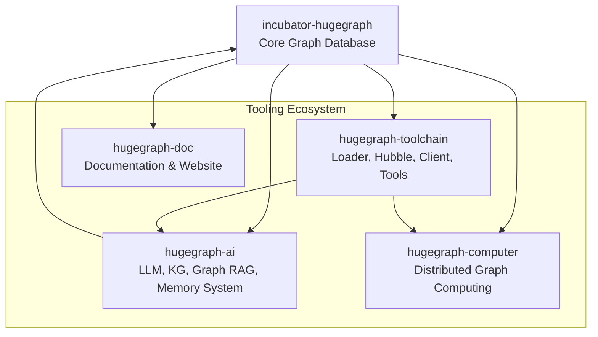

# Repo Adaptation Rules

This page describes how to map cross-repo memory into the HugeGraph layout.

## Scope Priority

1. Repo-level memory (this folder) is the source of truth.
2. Module-level `AGENTS.md` may add tighter rules for submodules.
3. Issue/PR context overrides when it is explicit and recent.

## Module Boundaries

- `hugegraph-server/`: core engine, REST, Gremlin/Cypher, backends.
- `hugegraph-pd/`: placement driver (meta, scheduling, discovery).
- `hugegraph-store/`: distributed storage (Raft + RocksDB).
- `hugegraph-commons/`: shared utilities and RPC framework.
- `hugegraph-struct/`: shared structs and serialization.
- `install-dist/`: distribution packaging and release docs.
- `hugegraph-cluster-test/`: cluster tests and integration.

## Navigation Hints

- Core engine entry points: `hugegraph-server/hugegraph-core/src/main/java/org/apache/hugegraph/`
- REST APIs: `hugegraph-server/hugegraph-api/src/main/java/org/apache/hugegraph/api/`
- gRPC protos: `hugegraph-pd/hg-pd-grpc/src/main/proto/`, `hugegraph-store/hg-store-grpc/src/main/proto/`

## Adaptation Rules

- Prefer module-local docs for behavior details.
- Cross-module changes should update this memory and the owning module docs.
- Add a brief note here when introducing new subsystem names or top-level folders.

---

## Ecosystem Repo Map

The HugeGraph project spans multiple repositories. This map shows their relationships
(inspired by Gbrain's brain + source dual-axis model).

### Repository Details

| Repository | Purpose | Primary Language | Key Dependency |
|-----------|---------|-----------------|---------------|
| `incubator-hugegraph` | Core graph database | Java 11 | TinkerPop 3.5.1 |
| `hugegraph-toolchain` | Data loading, visualization, clients | Java / JavaScript | hugegraph-server API |
| `hugegraph-ai` | LLM integration, knowledge graphs, RAG | Python | hugegraph-server, pyhugegraph |
| `hugegraph-computer` | OLAP graph computing | Java | hugegraph-server |
| `hugegraph-doc` | Official docs and website | Markdown / Vue | All repos |

---

## Knowledge Routing Rules

When answering questions or routing tasks, use this table to determine
which repository's memory to consult:

| Question / Task Domain | Primary Repo | Secondary Repo |
|----------------------|-------------|---------------|
| Graph engine, schema, traversal | incubator-hugegraph (server) | — |
| REST API endpoints | incubator-hugegraph (server) | hugegraph-toolchain (client) |
| Storage backends (RocksDB, MySQL) | incubator-hugegraph (server) | — |
| Distributed deployment (PD, Store) | incubator-hugegraph (pd+store) | — |
| Data loading, ETL | hugegraph-toolchain (loader) | incubator-hugegraph (API) |
| Web dashboard, visualization | hugegraph-toolchain (hubble) | — |
| LLM integration, Graph RAG | hugegraph-ai | incubator-hugegraph |
| Knowledge graph construction | hugegraph-ai | — |
| Memory System (repo knowledge graph) | hugegraph-ai | incubator-hugegraph |
| Graph algorithms (PageRank, etc.) | hugegraph-computer | incubator-hugegraph |
| Documentation, user guides | hugegraph-doc | All repos |

---

## Shared Concepts Glossary

Terms used across multiple repositories with consistent meanings:

| Term | Definition | Used In |
|------|-----------|--------|
| **VertexLabel** | Schema definition for vertex types | server, toolchain, ai |
| **EdgeLabel** | Schema definition for edge types | server, toolchain, ai |
| **PropertyKey** | Schema definition for property types | server, toolchain, ai |
| **Gremlin** | Graph traversal language (Apache TinkerPop) | server, toolchain, ai, computer |
| **Cypher** | Graph query language (OpenCypher) | server, ai |
| **GraphSpace** | Isolated graph namespace (HugeGraph >1.5.0) | server, ai, store |
| **PD (Placement Driver)** | Metadata coordination service | server, pd, store |
| **Store Node** | Distributed storage instance | server, pd, store |
| **Raft Group** | Consensus replication group | pd, store |
| **Partition** | Data shard assigned by PD | pd, store |
| **repo_tag** | Repository identifier in Memory System | ai (memory) |
| **BackendStore** | Storage backend interface | server (core) |
| **HugeFactory** | Graph instance factory | server (core) |

---

## Cross-Repo Version Compatibility

| HugeGraph Version | TinkerPop | Toolchain | AI | Computer |
|-------------------|-----------|-----------|-----|----------|
| 1.7.0 | 3.5.1 | 1.3.0 | 1.0.0 | 1.0.0 |
| 1.6.0 | 3.5.1 | 1.2.0 | 0.7.0 | 0.7.0 |
| 1.5.0 | 3.4.3 | 1.1.0 | 0.6.0 | 0.6.0 |

> Update this table when releasing new versions.
